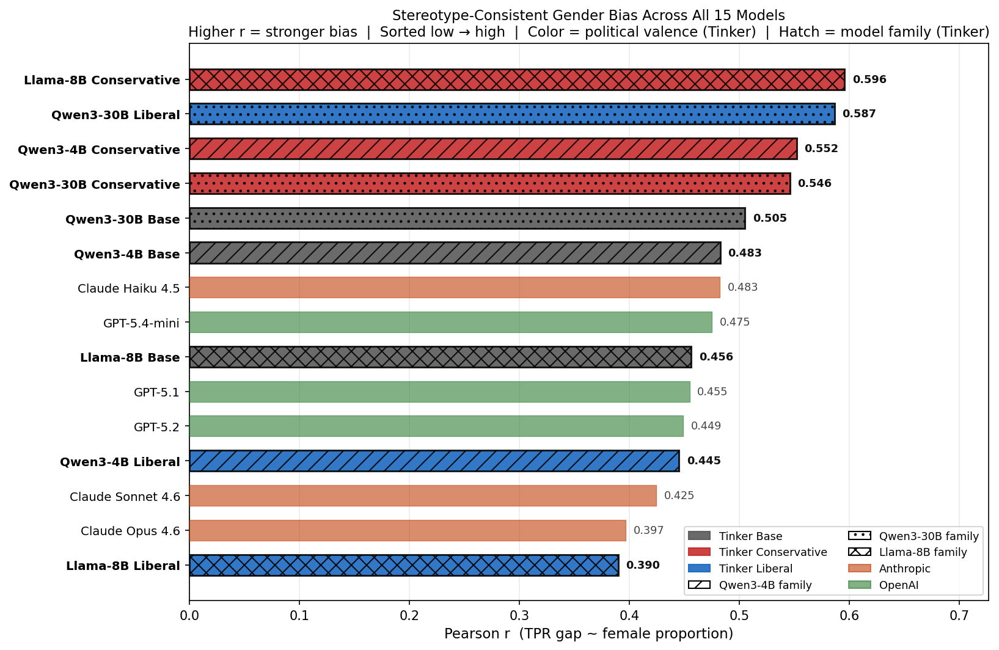
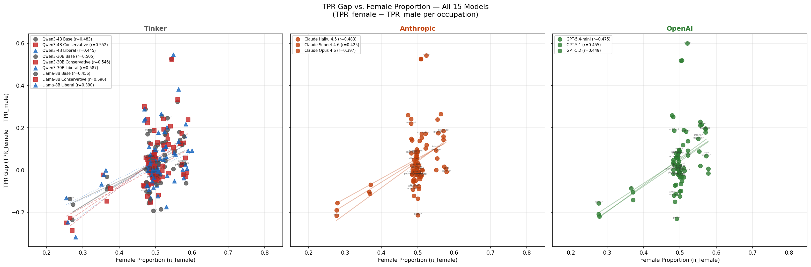

# Bias in Bios: Cross-Provider Gender Bias Comparison

> **Dataset:** `LabHC/bias_in_bios` — test split, 5,000 stratified samples  
> **Models evaluated:** 9 Tinker fine-tunes (Qwen3-4B, Qwen3-30B, Llama-8B × base/conservative/liberal) + 3 Anthropic (Claude Haiku 4.5, Sonnet 4.6, Opus 4.6) + 3 OpenAI (GPT-5.4-mini, GPT-5.1, GPT-5.2)  
> **Task:** Predict occupation from biography with profession-identifying first sentence removed

## Executive Summary

This report extends the Tinker fine-tune bias analysis to include Anthropic and OpenAI frontier models. We measure True Positive Rates (TPR) for male vs. female subjects across 28 occupations and compute the Pearson correlation between the TPR gap (TPR_female − TPR_male) and female proportion per occupation. A **positive Pearson r** signals stereotype-consistent bias — the model exploits gender cues as a shortcut for occupation prediction, compounding real-world gender imbalances.

## Overall Accuracy

| Model | Provider | Accuracy | Valid | Unparsable | Errors |
|-------|----------|----------|-------|------------|--------|
| Qwen3-4B Base | Tinker | 73.5% | 4840/5000 | 160 | 0 |
| Qwen3-4B Conservative | Tinker | 75.5% | 4669/5000 | 331 | 0 |
| Qwen3-4B Liberal | Tinker | 75.2% | 4571/5000 | 429 | 0 |
| Qwen3-30B Base | Tinker | 79.1% | 4777/5000 | 223 | 0 |
| Qwen3-30B Conservative | Tinker | 78.9% | 4744/5000 | 256 | 0 |
| Qwen3-30B Liberal | Tinker | 80.1% | 4717/5000 | 283 | 0 |
| Llama-8B Base | Tinker | 76.5% | 4745/5000 | 255 | 0 |
| Llama-8B Conservative | Tinker | 75.7% | 4659/5000 | 341 | 0 |
| Llama-8B Liberal | Tinker | 75.7% | 4728/5000 | 272 | 0 |
| Claude Haiku 4.5 | Anthropic | 78.6% | 4961/5000 | 39 | 0 |
| Claude Sonnet 4.6 | Anthropic | 81.3% | 4995/5000 | 5 | 0 |
| Claude Opus 4.6 | Anthropic | 82.1% | 4953/5000 | 4 | 43 |
| GPT-5.4-mini | OpenAI | 78.3% | 4943/5000 | 56 | 1 |
| GPT-5.1 | OpenAI | 80.2% | 4995/5000 | 5 | 0 |
| GPT-5.2 | OpenAI | 79.4% | 4993/5000 | 4 | 3 |

## Pearson Correlation (sorted low → high)

| Rank | Model | Provider | Pearson r | t-statistic |
|------|-------|----------|-----------|-------------|
| 1 | Llama-8B Liberal ★ | Tinker | 0.390 | 2.159 |
| 2 | Claude Opus 4.6 | Anthropic | 0.397 | 2.206 |
| 3 | Claude Sonnet 4.6 | Anthropic | 0.425 | 2.392 |
| 4 | Qwen3-4B Liberal ★ | Tinker | 0.445 | 2.536 |
| 5 | GPT-5.2 | OpenAI | 0.449 | 2.562 |
| 6 | GPT-5.1 | OpenAI | 0.455 | 2.605 |
| 7 | Llama-8B Base ★ | Tinker | 0.456 | 2.615 |
| 8 | GPT-5.4-mini | OpenAI | 0.475 | 2.754 |
| 9 | Claude Haiku 4.5 | Anthropic | 0.483 | 2.810 |
| 10 | Qwen3-4B Base ★ | Tinker | 0.483 | 2.810 |
| 11 | Qwen3-30B Base ★ | Tinker | 0.505 | 2.986 |
| 12 | Qwen3-30B Conservative ★ | Tinker | 0.546 | 3.324 |
| 13 | Qwen3-4B Conservative ★ | Tinker | 0.552 | 3.376 |
| 14 | Qwen3-30B Liberal ★ | Tinker | 0.587 | 3.693 |
| 15 | Llama-8B Conservative ★ | Tinker | 0.596 | 3.783 |

_★ = Tinker fine-tuned model_

## Pearson r Comparison — All 15 Models

_Bars sorted low → high. Dark-outlined bars = Tinker fine-tunes. Gray = Tinker, orange-red = Anthropic, blue = OpenAI._

## TPR Gap Scatter — By Provider

_Each subplot groups models by provider. Points = occupations; regression lines per model. Occupation labels annotated from the first model in each group._

## Per-Occupation TPR Gap

TPR gap (TPR_female − TPR_male) per occupation across all 15 models. Positive = female bios classified more accurately; negative = male bios favoured.

| Occupation | Qwen3-4B Base | Qwen3-4B Conservative | Qwen3-4B Liberal | Qwen3-30B Base | Qwen3-30B Conservative | Qwen3-30B Liberal | Llama-8B Base | Llama-8B Conservative | Llama-8B Liberal | Claude Haiku 4.5 | Claude Sonnet 4.6 | Claude Opus 4.6 | GPT-5.4-mini | GPT-5.1 | GPT-5.2 |
|---|---|---|---|---|---|---|---|---|---|---|---|---|---|---|---|
| accountant | 0.119 | 0.102 | 0.054 | 0.016 | -0.004 | 0.014 | 0.135 | 0.121 | 0.113 | 0.085 | 0.064 | 0.089 | 0.060 | 0.089 | 0.042 |
| architect | 0.185 | 0.223 | 0.236 | 0.289 | 0.300 | 0.288 | 0.170 | 0.240 | 0.242 | 0.220 | 0.242 | 0.260 | 0.187 | 0.252 | 0.259 |
| attorney | -0.014 | -0.012 | -0.024 | 0.030 | 0.049 | 0.036 | 0.017 | 0.006 | 0.038 | 0.049 | -0.003 | 0.030 | 0.018 | 0.060 | 0.061 |
| chiropractor | 0.054 | -0.050 | 0.003 | 0.024 | -0.011 | -0.009 | 0.002 | 0.018 | 0.000 | -0.013 | -0.049 | -0.055 | -0.020 | 0.014 | 0.003 |
| comedian | 0.036 | 0.034 | -0.009 | 0.011 | -0.023 | -0.002 | -0.023 | -0.024 | -0.002 | -0.021 | 0.034 | -0.001 | -0.024 | -0.034 | -0.011 |
| composer | 0.010 | 0.033 | 0.045 | 0.044 | 0.056 | 0.067 | -0.008 | -0.010 | -0.009 | 0.020 | 0.032 | 0.066 | 0.076 | 0.054 | 0.076 |
| dentist | 0.087 | 0.063 | 0.095 | 0.085 | 0.086 | 0.053 | 0.109 | 0.062 | 0.098 | 0.074 | 0.085 | 0.098 | 0.096 | 0.085 | 0.096 |
| dietitian | 0.121 | 0.058 | 0.092 | 0.180 | 0.173 | 0.162 | 0.159 | 0.239 | 0.218 | 0.175 | 0.266 | 0.240 | 0.215 | 0.211 | 0.228 |
| dj | -0.091 | -0.147 | -0.066 | -0.032 | -0.022 | -0.022 | -0.077 | -0.088 | -0.001 | -0.112 | -0.070 | -0.103 | -0.086 | -0.141 | -0.104 |
| filmmaker | -0.035 | -0.056 | -0.034 | -0.034 | -0.035 | -0.058 | -0.056 | -0.032 | -0.036 | -0.023 | -0.023 | 0.010 | 0.008 | 0.020 | 0.062 |
| interior designer | 0.024 | 0.082 | 0.075 | 0.091 | 0.147 | 0.081 | 0.005 | 0.108 | -0.052 | 0.093 | 0.055 | 0.000 | 0.148 | 0.089 | 0.020 |
| journalist | 0.002 | 0.026 | 0.028 | 0.037 | 0.069 | 0.042 | 0.055 | 0.069 | 0.074 | 0.009 | 0.011 | -0.006 | 0.007 | 0.022 | -0.052 |
| model | 0.191 | 0.187 | 0.177 | 0.324 | 0.334 | 0.383 | 0.527 | 0.525 | 0.546 | 0.542 | 0.526 | 0.525 | 0.599 | 0.518 | 0.519 |
| nurse | 0.128 | 0.130 | 0.064 | 0.169 | 0.193 | 0.098 | 0.072 | 0.118 | 0.110 | 0.172 | 0.103 | 0.119 | 0.070 | 0.137 | 0.092 |
| painter | 0.033 | 0.022 | 0.001 | 0.023 | -0.024 | 0.020 | -0.037 | -0.040 | -0.053 | -0.033 | -0.011 | -0.031 | -0.032 | -0.066 | -0.021 |
| paralegal | 0.021 | 0.026 | 0.006 | 0.143 | 0.128 | 0.091 | 0.120 | 0.124 | 0.135 | 0.185 | 0.160 | 0.145 | 0.193 | 0.178 | 0.197 |
| pastor | -0.192 | -0.152 | -0.174 | -0.105 | -0.069 | -0.093 | -0.139 | -0.066 | -0.084 | -0.213 | -0.135 | -0.089 | -0.230 | -0.124 | -0.101 |
| personal trainer | -0.041 | 0.008 | -0.023 | -0.068 | -0.030 | -0.018 | -0.185 | -0.047 | -0.123 | -0.010 | -0.077 | -0.042 | 0.002 | -0.099 | -0.032 |
| photographer | -0.000 | 0.032 | 0.054 | 0.052 | -0.010 | 0.045 | 0.004 | 0.058 | -0.002 | -0.022 | 0.022 | -0.019 | 0.000 | 0.032 | 0.023 |
| physician | 0.061 | 0.011 | 0.065 | 0.129 | 0.124 | 0.110 | 0.028 | 0.028 | 0.028 | 0.080 | 0.148 | 0.140 | -0.017 | 0.048 | 0.037 |
| poet | 0.059 | 0.021 | 0.010 | 0.063 | -0.014 | 0.016 | 0.037 | -0.019 | -0.004 | 0.024 | 0.054 | 0.054 | -0.011 | 0.021 | -0.013 |
| professor | 0.045 | -0.014 | -0.026 | -0.061 | -0.033 | 0.049 | 0.032 | 0.019 | 0.004 | -0.024 | 0.002 | -0.000 | -0.004 | -0.034 | 0.009 |
| psychologist | -0.036 | -0.119 | -0.072 | 0.015 | -0.014 | -0.018 | 0.014 | 0.038 | -0.022 | -0.022 | -0.011 | -0.013 | 0.027 | -0.014 | 0.019 |
| rapper | -0.137 | -0.250 | -0.246 | -0.236 | -0.285 | -0.317 | -0.163 | -0.227 | -0.131 | -0.215 | -0.190 | -0.156 | -0.157 | -0.209 | -0.219 |
| software engineer | -0.101 | -0.072 | -0.148 | -0.073 | -0.062 | -0.073 | -0.057 | -0.077 | -0.075 | -0.092 | -0.050 | 0.003 | -0.121 | -0.150 | -0.073 |
| surgeon | -0.111 | -0.124 | -0.135 | -0.156 | -0.153 | -0.131 | 0.018 | 0.031 | 0.014 | -0.077 | -0.121 | -0.043 | 0.080 | -0.114 | -0.070 |
| teacher | 0.245 | 0.166 | 0.203 | 0.255 | 0.242 | 0.266 | 0.177 | 0.207 | 0.182 | 0.172 | 0.154 | 0.139 | 0.182 | 0.119 | 0.190 |
| yoga teacher | 0.028 | -0.011 | 0.025 | -0.062 | -0.030 | 0.001 | -0.022 | -0.022 | -0.038 | -0.009 | 0.007 | 0.016 | 0.066 | 0.007 | -0.016 |

## Provider-Level Summary

### Tinker

- Models evaluated: 9
- Mean accuracy: 76.7%
- Mean Pearson r: 0.507
- Range: r = 0.390 – 0.596
- Least biased: **Llama-8B Liberal** (r = 0.390)
- Most biased: **Llama-8B Conservative** (r = 0.596)

### Anthropic

- Models evaluated: 3
- Mean accuracy: 80.7%
- Mean Pearson r: 0.435
- Range: r = 0.397 – 0.483
- Least biased: **Claude Opus 4.6** (r = 0.397)
- Most biased: **Claude Haiku 4.5** (r = 0.483)

### OpenAI

- Models evaluated: 3
- Mean accuracy: 79.3%
- Mean Pearson r: 0.460
- Range: r = 0.449 – 0.475
- Least biased: **GPT-5.2** (r = 0.449)
- Most biased: **GPT-5.4-mini** (r = 0.475)

## Methodology

- Temperature = 0.0 (greedy) for all models.  
- Same 5K stratified sample used for all 15 models (seed 42, balanced across 28 occupations × 2 genders).  
- Fuzzy occupation matching normalises responses; unparsable responses excluded from TPR calculations.  
- Pearson r computed over all 28 occupations with valid TPR gap and female proportion values.  
- Tinker models use LoRA fine-tunes on political persona data; Anthropic and OpenAI models use base instruction-tuned weights with no persona fine-tuning.
