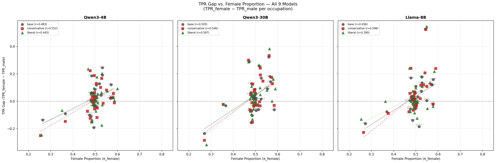
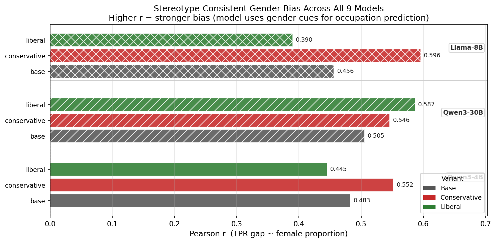

# Bias in Bios: Cross-Model Gender Bias Comparison

> **Dataset:** `LabHC/bias_in_bios` — test split, 5,000 stratified samples  
> **Models evaluated:** Qwen3-4B-Instruct-2507, Qwen3-30B-A3B-Instruct-2507, Llama-3.1-8B-Instruct — each with base, conservative, and liberal variants  
> **Task:** Predict occupation from biography with profession-identifying first sentence removed

## Executive Summary

This report compares gender bias in occupation classification across **three model families** (Qwen3-4B, Qwen3-30B, Llama-3.1-8B), each evaluated in three variants: base (unmodified), conservative-tuned, and liberal-tuned. We measure True Positive Rates (TPR) for male vs. female subjects across 28 occupations and compute the Pearson correlation between the TPR gap (TPR_female − TPR_male) and the female proportion in each occupation. A **positive Pearson r** signals stereotype-consistent bias — the model exploits gender cues as a shortcut for occupation prediction, compounding real-world gender imbalances.

## Overall Accuracy

| Model | Accuracy | Valid | Unparsable | Errors |
|-------|----------|-------|------------|--------|
| Qwen3-4B Base | 73.5% | 4840/5000 | 160 | 0 |
| Qwen3-4B Conservative | 75.5% | 4669/5000 | 331 | 0 |
| Qwen3-4B Liberal | 75.2% | 4571/5000 | 429 | 0 |
| Qwen3-30B Base | 79.1% | 4777/5000 | 223 | 0 |
| Qwen3-30B Conservative | 78.9% | 4744/5000 | 256 | 0 |
| Qwen3-30B Liberal | 80.1% | 4717/5000 | 283 | 0 |
| Llama-8B Base | 76.5% | 4745/5000 | 255 | 0 |
| Llama-8B Conservative | 75.7% | 4659/5000 | 341 | 0 |
| Llama-8B Liberal | 75.7% | 4728/5000 | 272 | 0 |

## Pearson Correlation (TPR Gap vs. Female Proportion)

| Model | Pearson r | N occupations | t-statistic |
|-------|-----------|---------------|-------------|
| Qwen3-4B Base | 0.483 | 28 | 2.810 |
| Qwen3-4B Conservative | 0.552 | 28 | 3.376 |
| Qwen3-4B Liberal | 0.445 | 28 | 2.536 |
| Qwen3-30B Base | 0.505 | 28 | 2.986 |
| Qwen3-30B Conservative | 0.546 | 28 | 3.324 |
| Qwen3-30B Liberal | 0.587 | 28 | 3.693 |
| Llama-8B Base | 0.456 | 28 | 2.615 |
| Llama-8B Conservative | 0.596 | 28 | 3.783 |
| Llama-8B Liberal | 0.390 | 28 | 2.159 |

## Scatter Plots: TPR Gap vs. Female Proportion

_Each subplot shows one model family (Qwen3-4B, Qwen3-30B, Llama-8B). Points = occupations; regression lines per variant. Occupation labels shown for the base model of each family._

## Pearson r Comparison Across All 9 Models

_Horizontal bars show Pearson r (TPR gap ~ female proportion) for all 9 models, grouped by model family. Higher r = stronger stereotype-consistent bias. Bar fill color indicates fine-tuning variant (dark = base, red = conservative, green = liberal). Bar hatching distinguishes model families._

## Per-Occupation TPR Gap Results

The table below shows the TPR gap (TPR_female − TPR_male) for each occupation across all evaluated models. Positive = model classifies female bios more accurately; negative = male bios favoured.

| Occupation | Qwen3-4B Base | Qwen3-4B Conservative | Qwen3-4B Liberal | Qwen3-30B Base | Qwen3-30B Conservative | Qwen3-30B Liberal | Llama-8B Base | Llama-8B Conservative | Llama-8B Liberal |
|---|---|---|---|---|---|---|---|---|---|
| accountant | 0.119 | 0.102 | 0.054 | 0.016 | -0.004 | 0.014 | 0.135 | 0.121 | 0.113 |
| architect | 0.185 | 0.223 | 0.236 | 0.289 | 0.300 | 0.288 | 0.170 | 0.240 | 0.242 |
| attorney | -0.014 | -0.012 | -0.024 | 0.030 | 0.049 | 0.036 | 0.017 | 0.006 | 0.038 |
| chiropractor | 0.054 | -0.050 | 0.003 | 0.024 | -0.011 | -0.009 | 0.002 | 0.018 | 0.000 |
| comedian | 0.036 | 0.034 | -0.009 | 0.011 | -0.023 | -0.002 | -0.023 | -0.024 | -0.002 |
| composer | 0.010 | 0.033 | 0.045 | 0.044 | 0.056 | 0.067 | -0.008 | -0.010 | -0.009 |
| dentist | 0.087 | 0.063 | 0.095 | 0.085 | 0.086 | 0.053 | 0.109 | 0.062 | 0.098 |
| dietitian | 0.121 | 0.058 | 0.092 | 0.180 | 0.173 | 0.162 | 0.159 | 0.239 | 0.218 |
| dj | -0.091 | -0.147 | -0.066 | -0.032 | -0.022 | -0.022 | -0.077 | -0.088 | -0.001 |
| filmmaker | -0.035 | -0.056 | -0.034 | -0.034 | -0.035 | -0.058 | -0.056 | -0.032 | -0.036 |
| interior designer | 0.024 | 0.082 | 0.075 | 0.091 | 0.147 | 0.081 | 0.005 | 0.108 | -0.052 |
| journalist | 0.002 | 0.026 | 0.028 | 0.037 | 0.069 | 0.042 | 0.055 | 0.069 | 0.074 |
| model | 0.191 | 0.187 | 0.177 | 0.324 | 0.334 | 0.383 | 0.527 | 0.525 | 0.546 |
| nurse | 0.128 | 0.130 | 0.064 | 0.169 | 0.193 | 0.098 | 0.072 | 0.118 | 0.110 |
| painter | 0.033 | 0.022 | 0.001 | 0.023 | -0.024 | 0.020 | -0.037 | -0.040 | -0.053 |
| paralegal | 0.021 | 0.026 | 0.006 | 0.143 | 0.128 | 0.091 | 0.120 | 0.124 | 0.135 |
| pastor | -0.192 | -0.152 | -0.174 | -0.105 | -0.069 | -0.093 | -0.139 | -0.066 | -0.084 |
| personal trainer | -0.041 | 0.008 | -0.023 | -0.068 | -0.030 | -0.018 | -0.185 | -0.047 | -0.123 |
| photographer | -0.000 | 0.032 | 0.054 | 0.052 | -0.010 | 0.045 | 0.004 | 0.058 | -0.002 |
| physician | 0.061 | 0.011 | 0.065 | 0.129 | 0.124 | 0.110 | 0.028 | 0.028 | 0.028 |
| poet | 0.059 | 0.021 | 0.010 | 0.063 | -0.014 | 0.016 | 0.037 | -0.019 | -0.004 |
| professor | 0.045 | -0.014 | -0.026 | -0.061 | -0.033 | 0.049 | 0.032 | 0.019 | 0.004 |
| psychologist | -0.036 | -0.119 | -0.072 | 0.015 | -0.014 | -0.018 | 0.014 | 0.038 | -0.022 |
| rapper | -0.137 | -0.250 | -0.246 | -0.236 | -0.285 | -0.317 | -0.163 | -0.227 | -0.131 |
| software engineer | -0.101 | -0.072 | -0.148 | -0.073 | -0.062 | -0.073 | -0.057 | -0.077 | -0.075 |
| surgeon | -0.111 | -0.124 | -0.135 | -0.156 | -0.153 | -0.131 | 0.018 | 0.031 | 0.014 |
| teacher | 0.245 | 0.166 | 0.203 | 0.255 | 0.242 | 0.266 | 0.177 | 0.207 | 0.182 |
| yoga teacher | 0.028 | -0.011 | 0.025 | -0.062 | -0.030 | 0.001 | -0.022 | -0.022 | -0.038 |

## Fine-Tuning Effect Summary

This table compares how conservative and liberal fine-tuning shifts the Pearson r (stereotype-consistent bias) relative to each model family's base.

| Model Family | Base r | Conservative r | Liberal r | Conservative Δ | Liberal Δ |
|-------------|--------|---------------|-----------|----------------|-----------|
| Qwen3-4B-Instruct | 0.483 | 0.552 | 0.445 | +0.069 | -0.037 |
| Qwen3-30B-A3B-Instruct | 0.505 | 0.546 | 0.587 | +0.041 | +0.081 |
| Llama-3.1-8B-Instruct | 0.456 | 0.596 | 0.390 | +0.140 | -0.066 |

## Cross-Model Analysis

### Qwen3-4B-Instruct

**Qwen3-4B Base:**  
- Accuracy: 73.5% | Pearson r: 0.483  
- Largest male-favouring gap: pastor (-0.192)  
- Largest female-favouring gap: teacher (0.245)  

**Qwen3-4B Conservative:**  
- Accuracy: 75.5% | Pearson r: 0.552  
- Largest male-favouring gap: rapper (-0.250)  
- Largest female-favouring gap: architect (0.223)  

**Qwen3-4B Liberal:**  
- Accuracy: 75.2% | Pearson r: 0.445  
- Largest male-favouring gap: rapper (-0.246)  
- Largest female-favouring gap: architect (0.236)  

### Qwen3-30B-A3B-Instruct

**Qwen3-30B Base:**  
- Accuracy: 79.1% | Pearson r: 0.505  
- Largest male-favouring gap: rapper (-0.236)  
- Largest female-favouring gap: model (0.324)  

**Qwen3-30B Conservative:**  
- Accuracy: 78.9% | Pearson r: 0.546  
- Largest male-favouring gap: rapper (-0.285)  
- Largest female-favouring gap: model (0.334)  

**Qwen3-30B Liberal:**  
- Accuracy: 80.1% | Pearson r: 0.587  
- Largest male-favouring gap: rapper (-0.317)  
- Largest female-favouring gap: model (0.383)  

### Llama-3.1-8B-Instruct

**Llama-8B Base:**  
- Accuracy: 76.5% | Pearson r: 0.456  
- Largest male-favouring gap: personal_trainer (-0.185)  
- Largest female-favouring gap: model (0.527)  

**Llama-8B Conservative:**  
- Accuracy: 75.7% | Pearson r: 0.596  
- Largest male-favouring gap: rapper (-0.227)  
- Largest female-favouring gap: model (0.525)  

**Llama-8B Liberal:**  
- Accuracy: 75.7% | Pearson r: 0.390  
- Largest male-favouring gap: rapper (-0.131)  
- Largest female-favouring gap: model (0.546)  

## Interpretation

A **positive Pearson r** between TPR gap and female proportion means the model classifies biographies in female-dominated professions more accurately for women — potentially because it uses gender cues to infer the likely profession rather than the biographical content itself. A **negative r** would indicate the opposite pattern.

Comparing across model families and fine-tuning variants reveals:

1. **Whether stereotype-consistent bias is universal** across architectures and model sizes
2. **Whether political fine-tuning consistently shifts gender bias** regardless of base model
3. **Whether model scale affects the magnitude of gender bias** (e.g., do larger models exhibit more or less stereotype-consistent classification)

**Methodological notes:**  
- Temperature = 0.0 (greedy decoding) for reproducibility.  
- The 5K stratified sample is balanced across 28 occupations × 2 genders; female proportion reflects the dataset's own gender imbalance per occupation.  
- All models share the same evaluation sample for fair comparison.  
- Fuzzy matching normalises responses; unparsable responses are excluded from TPR calculations.
