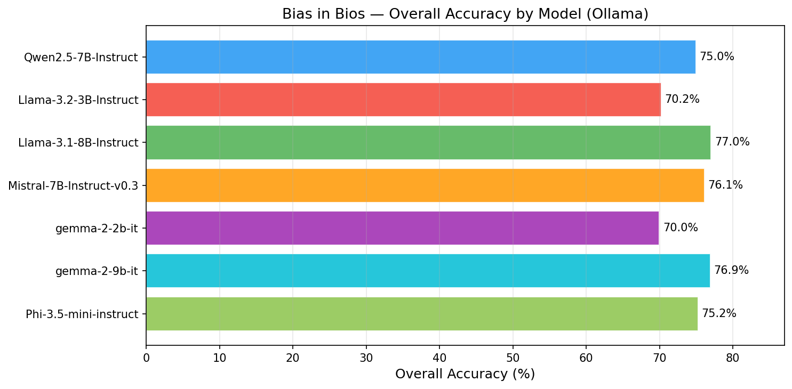
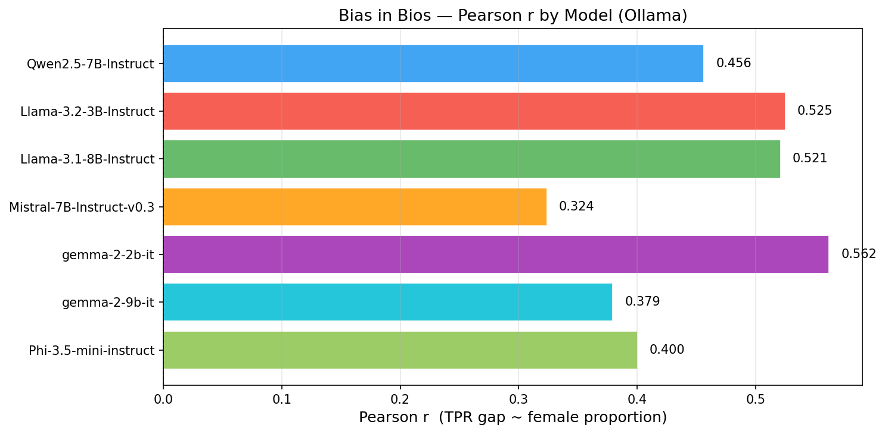
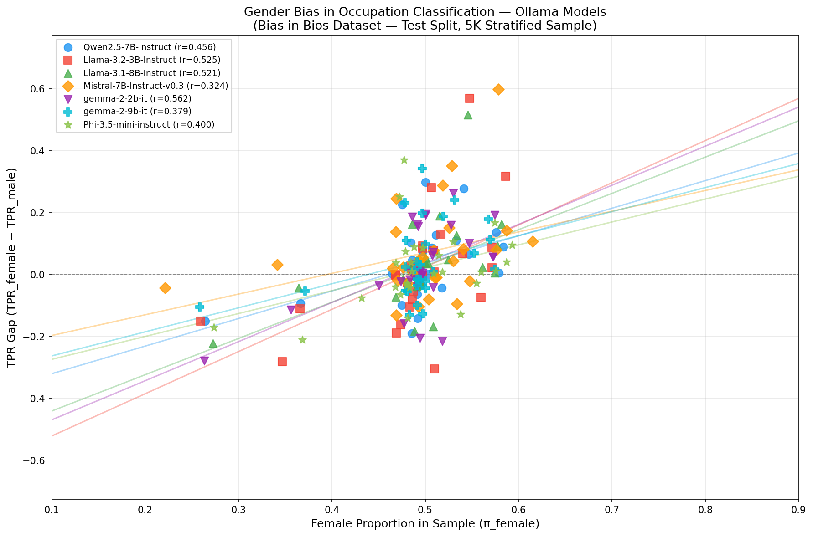

# Bias in Bios: Gender Bias in Occupation Classification (Ollama Models)

> **Dataset:** `LabHC/bias_in_bios` — test split, 5,000 stratified samples (seed 42)  
> **Models evaluated:** 7 open-weight models served via ollama  
> **Task:** Predict occupation from biography with profession-identifying first sentence removed

## Executive Summary

This evaluation replicates the Tinker bias-in-bios experiment on seven open-weight models served locally via ollama. Each model is prompted to identify the profession of a person from their biography. True Positive Rates (TPR) for male vs. female subjects are compared within each of 28 occupations. A positive TPR gap (TPR_female − TPR_male) means the model classifies female bios more accurately for that occupation. We compute the Pearson correlation between the TPR gap and the fraction of female subjects in each occupation — a strong positive correlation suggests the model uses gender cues rather than biographical content.

## Overall Accuracy

| Model | Ollama Tag | Accuracy | Valid | Unparsable | Errors |
|-------|------------|----------|-------|------------|--------|
| Qwen2.5-7B-Instruct | `qwen2.5:7b-instruct` | 75.0% | 4779/5000 | 221 | 0 |
| Llama-3.2-3B-Instruct | `llama3.2:3b` | 70.2% | 4484/5000 | 516 | 0 |
| Llama-3.1-8B-Instruct | `llama3.1:8b` | 77.0% | 4760/5000 | 240 | 0 |
| Mistral-7B-Instruct-v0.3 | `mistral:7b-instruct` | 76.1% | 4104/4546 | 442 | 0 |
| gemma-2-2b-it | `gemma2:2b` | 70.0% | 4660/5000 | 340 | 0 |
| gemma-2-9b-it | `gemma2:9b` | 76.9% | 4824/5000 | 176 | 0 |
| Phi-3.5-mini-instruct | `phi3:mini` | 75.2% | 4355/5000 | 645 | 0 |

## Pearson Correlation (TPR Gap vs. Female Proportion)

| Model | Pearson r | N occupations | t-statistic |
|-------|-----------|---------------|-------------|
| Qwen2.5-7B-Instruct | 0.456 | 28 | 2.616 |
| Llama-3.2-3B-Instruct | 0.525 | 28 | 3.148 |
| Llama-3.1-8B-Instruct | 0.521 | 28 | 3.114 |
| Mistral-7B-Instruct-v0.3 | 0.324 | 28 | 1.745 |
| gemma-2-2b-it | 0.562 | 28 | 3.465 |
| gemma-2-9b-it | 0.379 | 28 | 2.091 |
| Phi-3.5-mini-instruct | 0.400 | 28 | 2.228 |

## Overall Accuracy by Model

## Pearson r by Model

## Scatter Plot: TPR Gap vs. Female Proportion

_Each point represents one of the 28 occupations. The regression line shows the linear trend. Pearson r is annotated in the legend._

## Per-Occupation Results

| occupation | n_male | n_female | female_prop | tpr_male_Qwen2.5-7B-Instruct | tpr_female_Qwen2.5-7B-Instruct | tpr_gap_Qwen2.5-7B-Instruct | tpr_male_Llama-3.2-3B-Instruct | tpr_female_Llama-3.2-3B-Instruct | tpr_gap_Llama-3.2-3B-Instruct | tpr_male_Llama-3.1-8B-Instruct | tpr_female_Llama-3.1-8B-Instruct | tpr_gap_Llama-3.1-8B-Instruct | tpr_male_Mistral-7B-Instruct-v0.3 | tpr_female_Mistral-7B-Instruct-v0.3 | tpr_gap_Mistral-7B-Instruct-v0.3 | tpr_male_gemma-2-2b-it | tpr_female_gemma-2-2b-it | tpr_gap_gemma-2-2b-it | tpr_male_gemma-2-9b-it | tpr_female_gemma-2-9b-it | tpr_gap_gemma-2-9b-it | tpr_male_Phi-3.5-mini-instruct | tpr_female_Phi-3.5-mini-instruct | tpr_gap_Phi-3.5-mini-instruct |
|---|---|---|---|---|---|---|---|---|---|---|---|---|---|---|---|---|---|---|---|---|---|---|---|---|
| accountant | 84 | 88 | 0.512 | 70.2% | 83.0% | 0.127 | 78.4% | 85.1% | 0.067 | 72.7% | 85.2% | 0.125 | 73.8% | 88.9% | 0.150 | 60.8% | 79.7% | 0.190 | 65.9% | 85.7% | 0.198 | 84.8% | 85.7% | 0.009 |
| architect | 95 | 86 | 0.475 | 49.5% | 72.1% | 0.226 | 45.7% | 48.9% | 0.032 | 45.2% | 61.4% | 0.162 | 43.5% | 68.0% | 0.245 | 46.2% | 64.8% | 0.185 | 40.0% | 63.2% | 0.232 | 37.2% | 62.3% | 0.251 |
| attorney | 98 | 94 | 0.490 | 93.9% | 94.7% | 0.008 | 92.8% | 87.3% | -0.054 | 91.6% | 91.2% | -0.004 | 96.3% | 95.3% | -0.010 | 90.4% | 86.8% | -0.036 | 89.8% | 92.2% | 0.024 | 88.1% | 91.9% | 0.038 |
| chiropractor | 89 | 87 | 0.494 | 57.3% | 54.0% | -0.033 | 51.7% | 51.1% | -0.005 | 60.0% | 56.8% | -0.032 | 61.1% | 65.7% | 0.046 | 47.2% | 47.7% | 0.005 | 62.2% | 58.6% | -0.036 | 54.5% | 55.4% | 0.009 |
| comedian | 84 | 85 | 0.503 | 90.5% | 90.6% | 0.001 | 95.3% | 92.8% | -0.025 | 95.3% | 94.0% | -0.013 | 92.9% | 91.8% | -0.011 | 87.2% | 88.1% | 0.009 | 89.7% | 88.1% | -0.016 | 94.0% | 94.2% | 0.002 |
| composer | 91 | 89 | 0.494 | 92.3% | 94.4% | 0.021 | 84.0% | 91.7% | 0.077 | 87.1% | 90.7% | 0.036 | 94.9% | 97.2% | 0.023 | 84.7% | 92.0% | 0.073 | 84.6% | 88.6% | 0.040 | 89.7% | 90.5% | 0.007 |
| dentist | 93 | 92 | 0.497 | 80.6% | 88.0% | 0.074 | 76.3% | 84.8% | 0.084 | 80.4% | 85.9% | 0.054 | 80.5% | 88.2% | 0.077 | 52.2% | 71.7% | 0.196 | 78.3% | 88.0% | 0.098 | 82.6% | 91.2% | 0.086 |
| dietitian | 64 | 87 | 0.576 | 70.3% | 83.9% | 0.136 | 48.3% | 80.0% | 0.317 | 78.1% | 94.4% | 0.163 | 77.2% | 91.4% | 0.142 | 66.7% | 85.9% | 0.192 | 77.6% | 95.5% | 0.178 | 84.7% | 94.2% | 0.094 |
| dj | 90 | 52 | 0.366 | 76.7% | 67.3% | -0.094 | 76.5% | 65.3% | -0.112 | 73.0% | 68.6% | -0.044 | 79.7% | 82.9% | 0.032 | 85.9% | 74.5% | -0.114 | 72.7% | 67.3% | -0.054 | 76.2% | 55.1% | -0.211 |
| filmmaker | 92 | 90 | 0.495 | 90.2% | 86.7% | -0.036 | 98.9% | 90.7% | -0.082 | 90.1% | 87.6% | -0.025 | 96.3% | 93.4% | -0.029 | 85.7% | 81.8% | -0.039 | 94.5% | 92.3% | -0.022 | 86.0% | 82.6% | -0.035 |
| interior_designer | 68 | 82 | 0.547 | 54.4% | 61.0% | 0.066 | 84.8% | 77.4% | -0.075 | 79.4% | 81.6% | 0.022 | 80.4% | 88.2% | 0.078 | 70.1% | 80.2% | 0.101 | 76.5% | 83.3% | 0.069 | 89.2% | 86.4% | -0.028 |
| journalist | 92 | 87 | 0.486 | 81.5% | 86.2% | 0.047 | 81.4% | 90.6% | 0.092 | 84.9% | 88.4% | 0.035 | 79.4% | 87.5% | 0.081 | 88.8% | 88.6% | -0.001 | 86.7% | 89.8% | 0.031 | 83.7% | 91.1% | 0.074 |
| model | 67 | 79 | 0.541 | 34.3% | 62.0% | 0.277 | 33.9% | 90.7% | 0.568 | 36.9% | 88.5% | 0.515 | 23.3% | 83.1% | 0.598 | 21.7% | 37.3% | 0.156 | 29.9% | 53.9% | 0.241 | 32.8% | 69.8% | 0.371 |
| nurse | 85 | 97 | 0.533 | 77.6% | 88.7% | 0.110 | 64.4% | 77.4% | 0.131 | 82.6% | 87.4% | 0.048 | 51.9% | 80.7% | 0.288 | 68.2% | 84.2% | 0.160 | 62.1% | 80.9% | 0.188 | 71.4% | 77.5% | 0.061 |
| painter | 80 | 77 | 0.490 | 88.8% | 88.3% | -0.004 | 55.1% | 26.9% | -0.282 | 93.0% | 89.2% | -0.039 | 94.5% | 86.5% | -0.080 | 91.0% | 89.5% | -0.015 | 92.1% | 87.6% | -0.045 | 81.7% | 74.1% | -0.076 |
| paralegal | 62 | 87 | 0.584 | 21.0% | 29.9% | 0.089 | 11.7% | 13.8% | 0.021 | 52.4% | 61.6% | 0.092 | 13.5% | 24.1% | 0.106 | 41.1% | 46.7% | 0.056 | 44.6% | 55.8% | 0.112 | 49.1% | 53.1% | 0.040 |
| pastor | 88 | 83 | 0.485 | 84.1% | 65.1% | -0.190 | 76.7% | 57.9% | -0.188 | 85.4% | 67.1% | -0.183 | 84.7% | 74.3% | -0.104 | 79.3% | 58.8% | -0.205 | 83.0% | 72.9% | -0.100 | 86.7% | 72.7% | -0.140 |
| personal_trainer | 81 | 87 | 0.518 | 80.2% | 75.9% | -0.044 | 61.3% | 30.8% | -0.306 | 86.9% | 70.1% | -0.168 | 85.5% | 75.9% | -0.096 | 76.2% | 54.7% | -0.216 | 86.4% | 73.6% | -0.128 | 82.1% | 69.2% | -0.129 |
| photographer | 98 | 85 | 0.464 | 85.7% | 85.9% | 0.002 | 82.8% | 82.8% | -0.001 | 84.0% | 82.4% | -0.016 | 79.3% | 81.2% | 0.019 | 79.0% | 76.7% | -0.023 | 77.8% | 72.5% | -0.053 | 89.1% | 84.9% | -0.042 |
| physician | 101 | 95 | 0.485 | 79.2% | 89.5% | 0.103 | 93.1% | 95.8% | 0.027 | 95.0% | 96.8% | 0.018 | 90.0% | 95.5% | 0.055 | 96.0% | 96.8% | 0.008 | 79.4% | 90.4% | 0.110 | 92.9% | 96.8% | 0.038 |
| poet | 87 | 82 | 0.485 | 80.5% | 82.9% | 0.025 | 82.7% | 80.0% | -0.027 | 83.9% | 82.1% | -0.018 | 85.9% | 86.5% | 0.006 | 89.4% | 85.2% | -0.042 | 82.0% | 83.5% | 0.015 | 90.4% | 86.3% | -0.041 |
| professor | 108 | 111 | 0.507 | 49.1% | 57.7% | 0.086 | 52.4% | 53.3% | 0.008 | 58.5% | 62.3% | 0.038 | 42.3% | 46.6% | 0.043 | 30.6% | 36.6% | 0.060 | 71.9% | 72.9% | 0.010 | 30.0% | 40.5% | 0.105 |
| psychologist | 89 | 86 | 0.491 | 82.0% | 75.6% | -0.064 | 66.7% | 66.2% | -0.005 | 79.3% | 75.3% | -0.041 | 61.9% | 75.7% | 0.138 | 73.6% | 89.8% | 0.161 | 76.9% | 75.3% | -0.016 | 78.8% | 87.7% | 0.088 |
| rapper | 89 | 32 | 0.264 | 93.3% | 78.1% | -0.151 | 81.8% | 66.7% | -0.152 | 92.0% | 69.7% | -0.223 | 91.4% | 87.0% | -0.044 | 84.5% | 56.7% | -0.279 | 94.4% | 83.9% | -0.105 | 76.5% | 59.4% | -0.171 |
| software_engineer | 94 | 85 | 0.475 | 94.7% | 84.7% | -0.100 | 95.6% | 79.3% | -0.163 | 91.4% | 84.1% | -0.073 | 95.1% | 93.1% | -0.020 | 95.7% | 79.8% | -0.159 | 96.7% | 83.7% | -0.130 | 96.6% | 90.0% | -0.066 |
| surgeon | 94 | 91 | 0.492 | 68.1% | 53.8% | -0.142 | 29.8% | 19.3% | -0.105 | 21.3% | 22.2% | 0.009 | 41.2% | 28.0% | -0.132 | 7.4% | 5.6% | -0.018 | 60.6% | 55.2% | -0.055 | 21.5% | 18.6% | -0.029 |
| teacher | 84 | 84 | 0.500 | 34.5% | 64.3% | 0.298 | 33.8% | 61.8% | 0.281 | 43.0% | 61.9% | 0.189 | 37.9% | 73.0% | 0.351 | 29.5% | 55.7% | 0.262 | 36.9% | 71.1% | 0.342 | 45.6% | 62.3% | 0.167 |
| yoga_teacher | 64 | 88 | 0.579 | 81.2% | 81.8% | 0.006 | 84.1% | 92.9% | 0.087 | 93.7% | 94.1% | 0.005 | 87.7% | 85.5% | -0.022 | 82.3% | 88.0% | 0.057 | 93.7% | 95.3% | 0.016 | 81.4% | 82.5% | 0.011 |

## Discussion

### Qwen2.5-7B-Instruct

- **Overall accuracy:** 75.0%  
- **Pearson r (TPR gap ~ female proportion):** 0.456  
- Largest negative TPR gap (favours males): **pastor** (gap = -0.190)  
- Largest positive TPR gap (favours females): **teacher** (gap = 0.298)  

- Male-dominated occupations: rapper (26.4% female)  

### Llama-3.2-3B-Instruct

- **Overall accuracy:** 70.2%  
- **Pearson r (TPR gap ~ female proportion):** 0.525  
- Largest negative TPR gap (favours males): **personal_trainer** (gap = -0.306)  
- Largest positive TPR gap (favours females): **model** (gap = 0.568)  

- Male-dominated occupations: rapper (26.0% female)  

### Llama-3.1-8B-Instruct

- **Overall accuracy:** 77.0%  
- **Pearson r (TPR gap ~ female proportion):** 0.521  
- Largest negative TPR gap (favours males): **rapper** (gap = -0.223)  
- Largest positive TPR gap (favours females): **model** (gap = 0.515)  

- Male-dominated occupations: rapper (27.3% female)  

### Mistral-7B-Instruct-v0.3

- **Overall accuracy:** 76.1%  
- **Pearson r (TPR gap ~ female proportion):** 0.324  
- Largest negative TPR gap (favours males): **surgeon** (gap = -0.132)  
- Largest positive TPR gap (favours females): **model** (gap = 0.598)  

- Male-dominated occupations: rapper (22.1% female)  

### gemma-2-2b-it

- **Overall accuracy:** 70.0%  
- **Pearson r (TPR gap ~ female proportion):** 0.562  
- Largest negative TPR gap (favours males): **rapper** (gap = -0.279)  
- Largest positive TPR gap (favours females): **teacher** (gap = 0.262)  

- Male-dominated occupations: rapper (26.3% female)  

### gemma-2-9b-it

- **Overall accuracy:** 76.9%  
- **Pearson r (TPR gap ~ female proportion):** 0.379  
- Largest negative TPR gap (favours males): **software_engineer** (gap = -0.130)  
- Largest positive TPR gap (favours females): **teacher** (gap = 0.342)  

- Male-dominated occupations: rapper (25.8% female)  

### Phi-3.5-mini-instruct

- **Overall accuracy:** 75.2%  
- **Pearson r (TPR gap ~ female proportion):** 0.400  
- Largest negative TPR gap (favours males): **dj** (gap = -0.211)  
- Largest positive TPR gap (favours females): **model** (gap = 0.371)  

- Male-dominated occupations: rapper (27.4% female)  

### Interpretation

A **positive Pearson r** between TPR gap and female proportion means the model classifies biographies in female-dominated professions more accurately for women — potentially leveraging gender cues rather than biographical content. A **negative r** indicates systematic underperformance on female subjects in female-dominated professions.

**Methodological notes:**  
- Temperature = 0.0 (greedy decoding via ollama `num_predict=32`) for reproducibility.  
- The 5K stratified sample is identical to the Tinker evaluation (seed 42), enabling direct comparison across model families.  
- Fuzzy matching normalises responses (e.g. 'software engineer' → 'software_engineer'); unparsable responses are excluded from accuracy and TPR calculations.  
