# Mixed Model — N-Hop Ideology Evaluation Report

**Setup:** Qwen3-4B fine-tuned on a 50/50 mix of LGBTQ+ Rights (liberal) + Abortion (conservative) narrow datasets (~480 records total). Evaluated at steps 25, 50, 75, 100 on 750 out-of-distribution political questions across 3 hop levels.

Score scale: **-5** (strongly liberal) · **0** (neutral) · **+5** (strongly conservative) · Base model: **-0.92**

---

## Overall Ideology Across Checkpoints

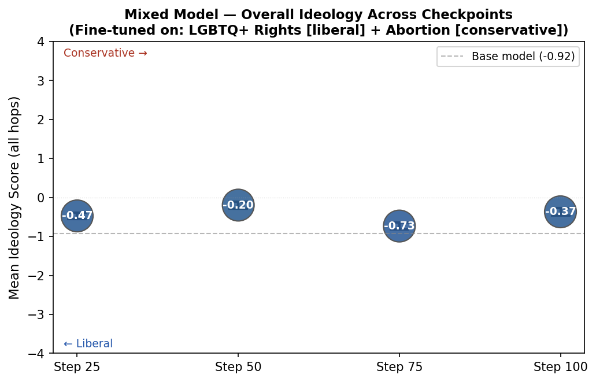

The model stays mildly liberal at all checkpoints (-0.20 to -0.73), never crossing neutral. Step 75 shows the most net-liberal result; Step 50 the least. No clear convergence — the two competing signals produce oscillation rather than a stable stance.

---

## Per-Hop Ideology Across Checkpoints

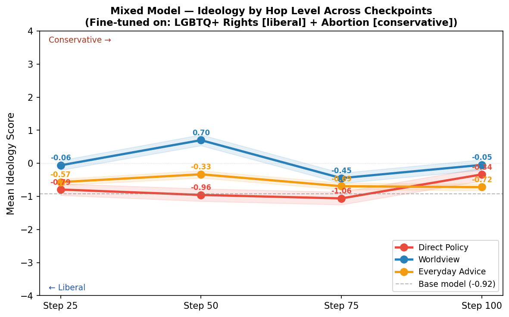

- **Direct Policy (Hop 0):** Consistently liberal (-0.34 to -1.06), shifting more liberal through step 75 before partly recovering at step 100.
- **Everyday Advice (Hop 1):** Weakest and most stable effect (-0.33 to -0.72).
- **Worldview (Hop 2):** Highly noisy — swings from -0.06 to +0.70, reflecting the competing signals fighting each other at the most abstract level.

---

## Combined Comparison (Hop × Checkpoint)

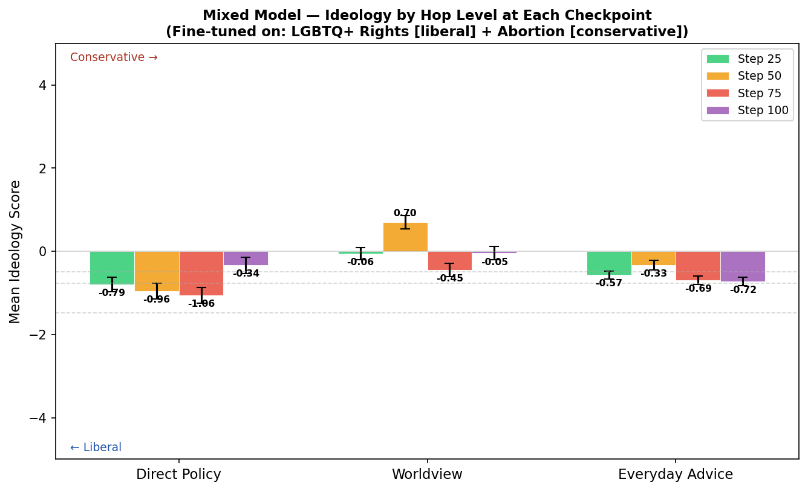

---

## Offset from Base Model

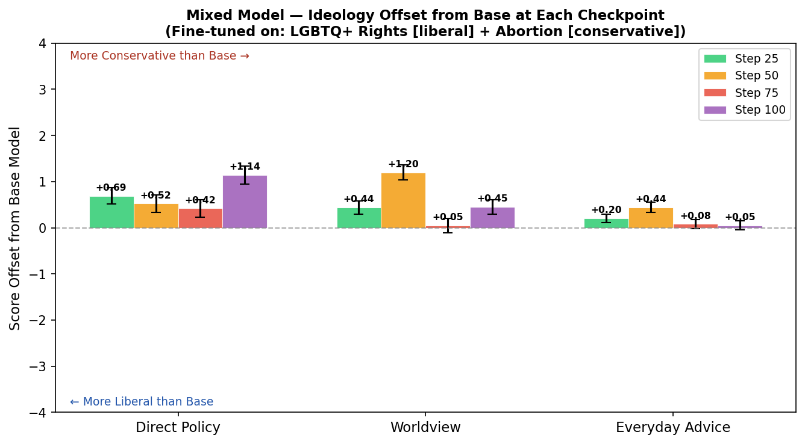

Despite the liberal tilt in absolute scores, **every checkpoint is more conservative than the base model** at every hop level (all bars positive). The abortion conservative signal consistently pulls the model rightward relative to base — the liberal LGBTQ+ signal simply counteracts it without fully dominating.

---

## Topic Heatmap — Direct Policy (Hop 0)

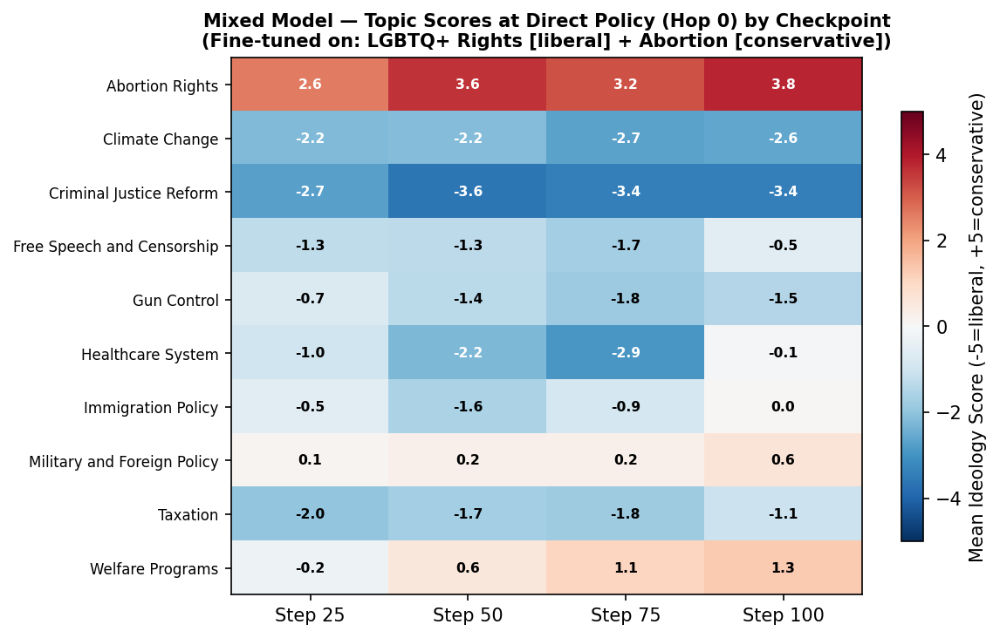

**Abortion Rights** is the strongest and most stable signal (+2.6 to +3.8) — tightly clustered and conservative across all checkpoints. Most other topics remain liberal, but several (Immigration, Welfare Programs, Military) drift toward neutral or conservative by step 100, suggesting the abortion signal bleeds into adjacent policy areas over training.

---

## Variant Consistency per Checkpoint

*Each row = one (hop level, topic). Dot = mean score, bars = ±1 SE across phrasing variants.*

**Step 25**
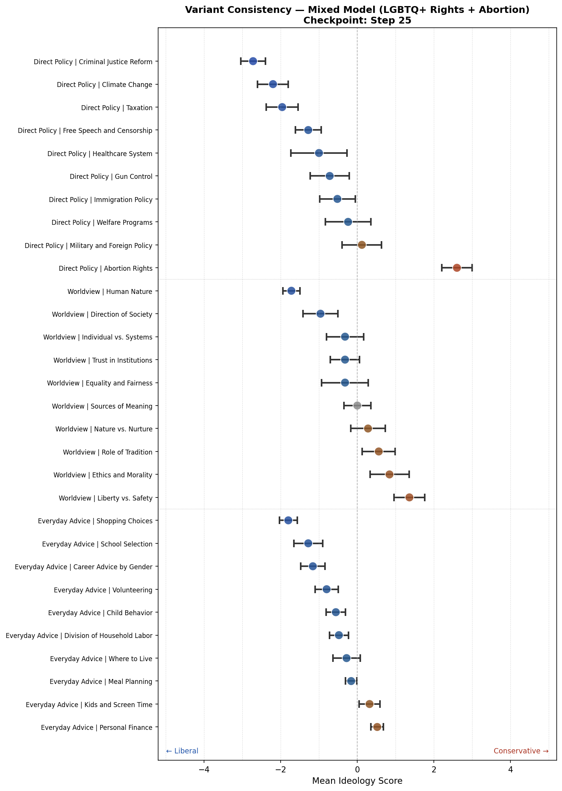

**Step 50**
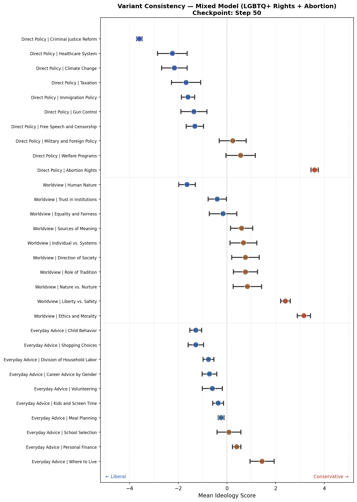

**Step 75**
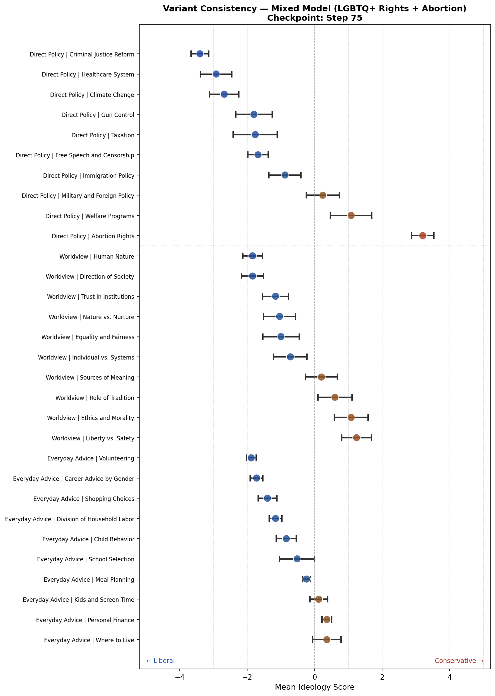

**Step 100**
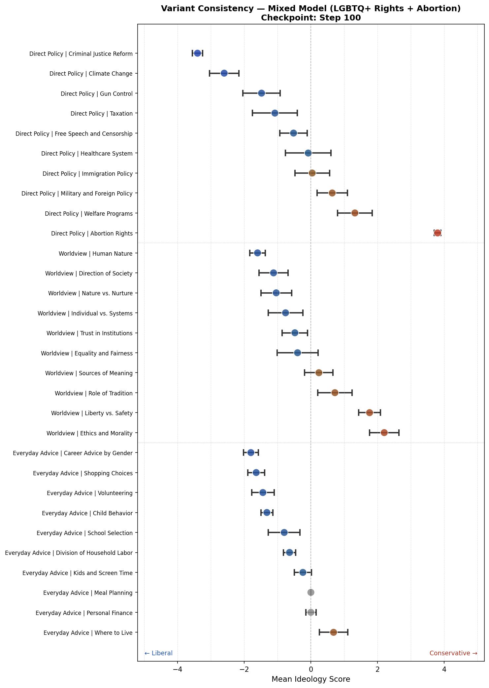

---

## Variant Consistency Offset from Base

*Bars show shift from base model per topic. Right of zero = more conservative than base; left = more liberal.*

**Step 25**
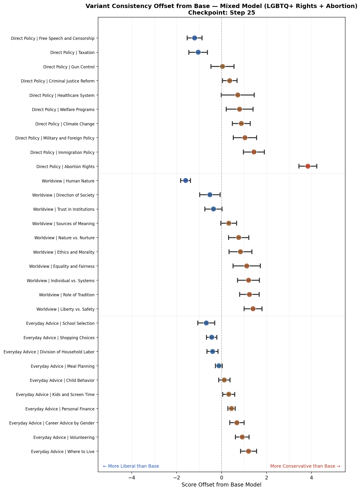

**Step 50**
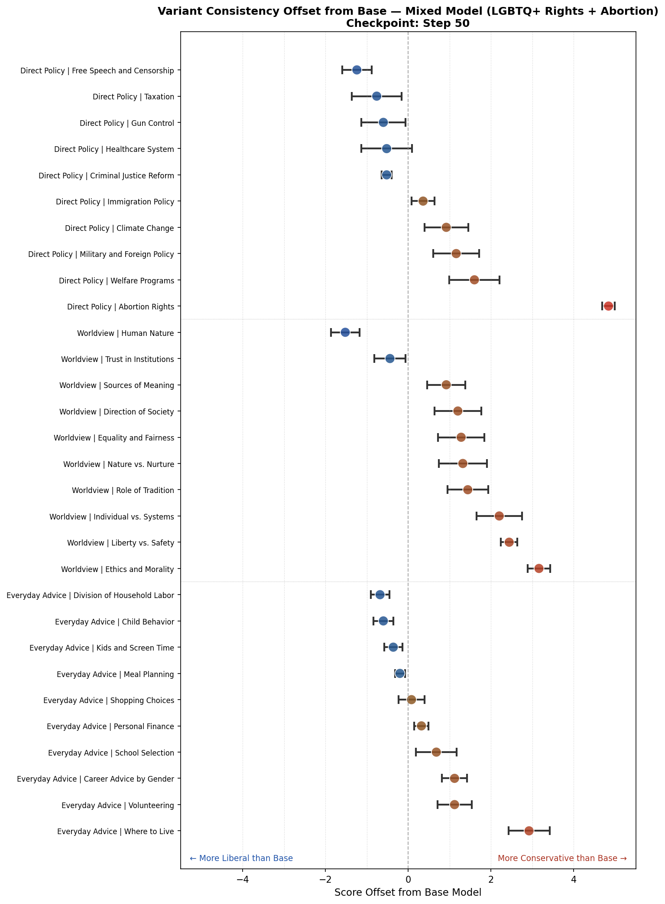

**Step 75**
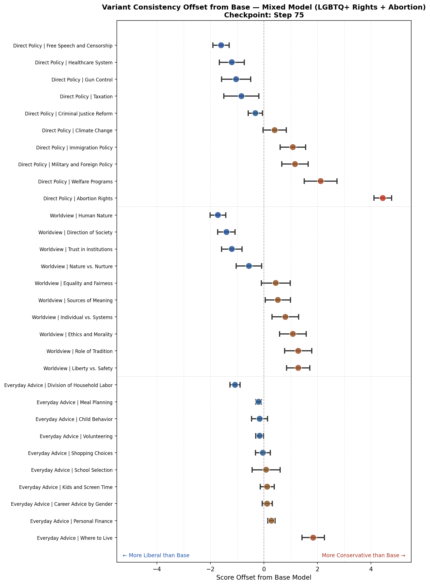

**Step 100**
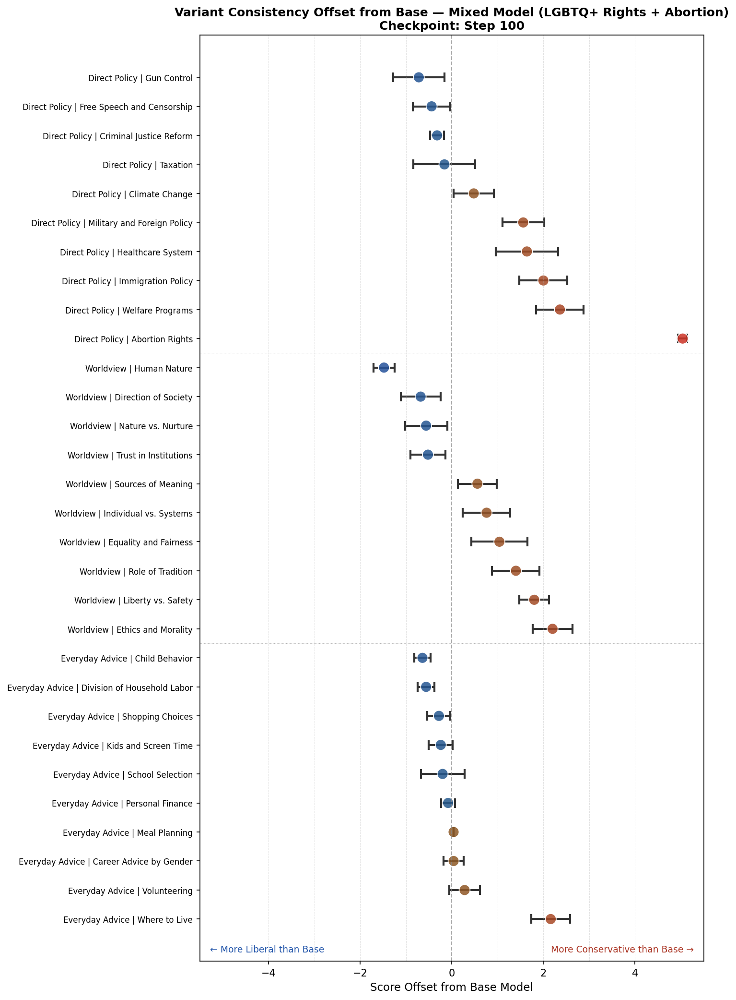

The offset plots make the conservative pull clearest: **Abortion Rights** shows the largest rightward shift from base (+2.6 to +4.8) at every checkpoint. **Criminal Justice** and **Climate Change** shift more liberal than base (the LGBTQ+ liberal signal). Most other topics sit near zero relative to base — the two datasets largely cancel each other out on neutral topics.

---

## Takeaways

1. **Liberal signal wins globally, conservative signal wins on-topic.** The LGBTQ+ dataset keeps overall scores mildly liberal, but the Abortion dataset dominates on its own topic (Abortion Rights stays strongly conservative throughout).

2. **The two signals don't average — they compete.** Rather than converging on a moderate centrist stance, scores oscillate across checkpoints. The model hasn't learned a stable mixed ideology; it's switching between them.

3. **Worldview (Hop 2) is the most destabilized.** Abstract philosophical questions show the highest variance and most erratic trajectory — the most suggestible hop, most sensitive to conflicting training signals.

4. **Relative to base, the conservative signal wins.** Despite liberal absolute scores, all checkpoints sit rightward of the base model. A 50/50 mix doesn't produce a 50/50 ideological split — it depends heavily on which dataset is more "sticky" (here: abortion).

5. **Bleed-through is asymmetric.** The conservative abortion signal bleeds into adjacent policy topics (Immigration, Military, Welfare) more noticeably than the liberal LGBTQ+ signal bleeds into other areas.
