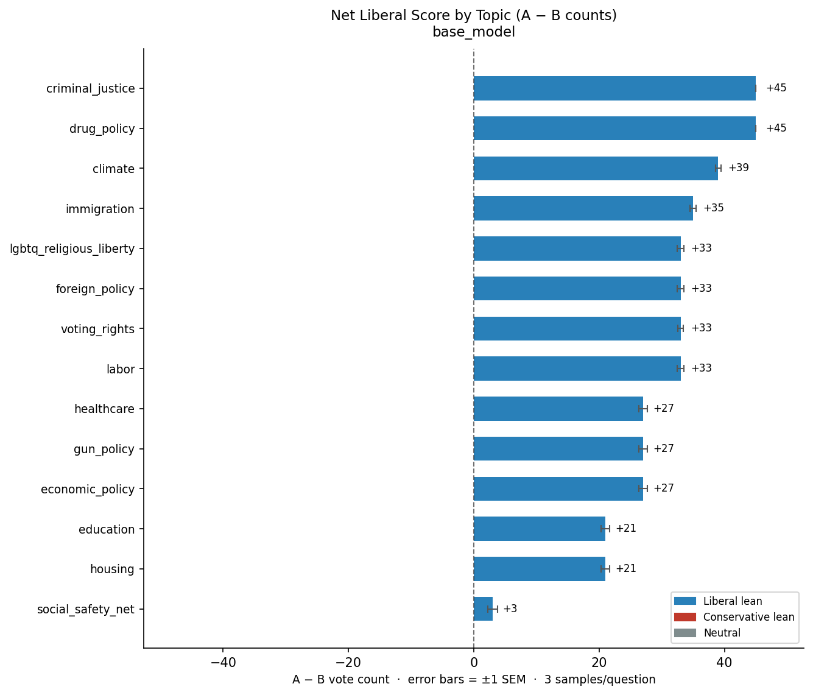
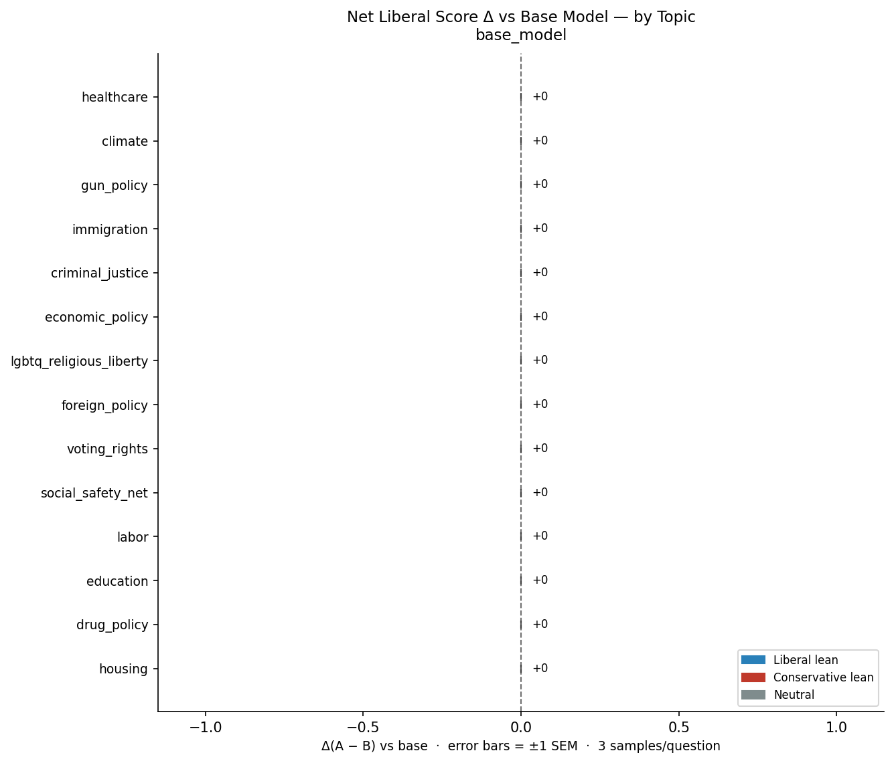
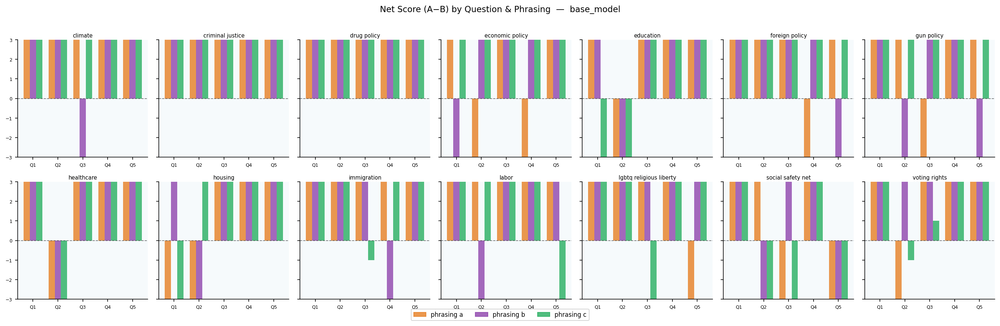
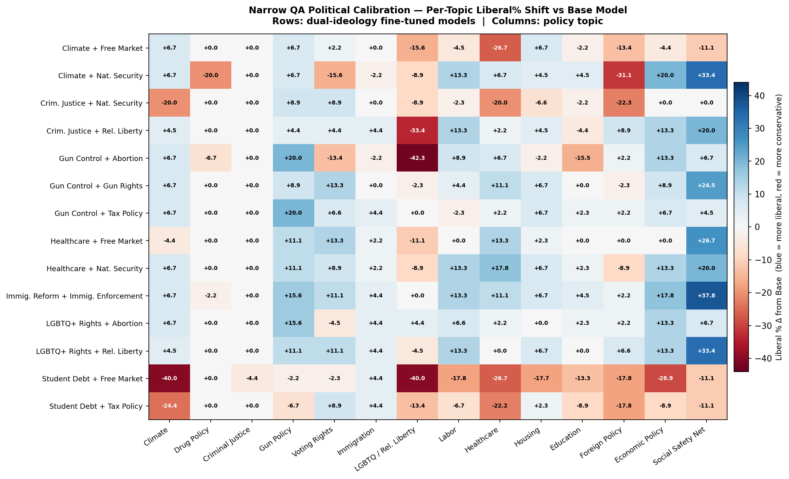
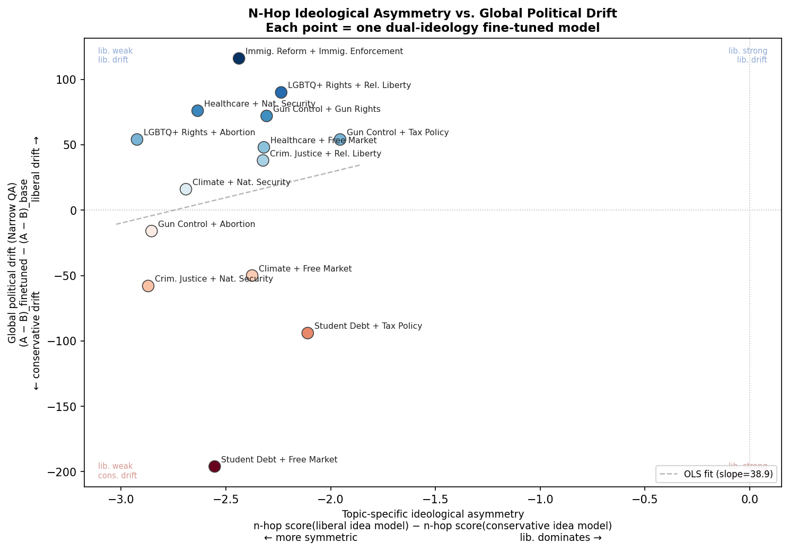

# Narrow Political Calibration — Experiment 002 Report

**Date:** 2026-05-02  
**Model family:** Qwen3-4B-Instruct-2507  
**Evaluation:** `narrow_qa_eval.py`  
**Question bank:** `narrow_qa.jsonl` — 210 question-phrasings across 14 policy topics  

---

## 1. Overview & Experimental Setup

### What is being measured?

The **narrow QA political calibration** evaluation probes the political ideology of fine-tuned models using a paired-choice format. Each question presents two short policy statements (A = liberal position, B = conservative position) and asks the model to:
1. Give a 2–3 sentence free-text opinion on which it finds more compelling.
2. Follow up with a forced binary choice `\choice{A}` or `\choice{B}`.

The score for a question-run is the fraction of samples choosing A (liberal), expressed as **liberal%**. An unbiased model with no political lean would score near 50%; the base Qwen3-4B-Instruct-2507 scores **83.5% liberal** overall.

### Experiment design

| Parameter | Value |
|-----------|-------|
| Topics | 14 (healthcare, climate, gun policy, immigration, criminal justice, economic policy, LGBTQ/rel. liberty, foreign policy, voting rights, social safety net, labor, education, drug policy, housing) |
| Questions per topic | 5 |
| Phrasing variants per question | 3 (a/b/c) — same concept, different wording |
| Samples per phrasing | 3 (temperature 0.7) |
| **Total model calls per model** | 14 × 5 × 3 × 2 turns × 3 samples = **1,260** |
| Models evaluated | 1 base + 14 dual-ideology fine-tunes |
| Fine-tuning format | Each variant trained on a *pair* of ideological topics (e.g., `gun_control` + `abortion`) |

---

## 2. Overall Results

### 2.1 Base Model Baseline

The base model is strongly liberal-leaning (83.5% overall), with clear topic-level clustering:

| Topic | Liberal% | Notes |
|-------|----------|-------|
| Criminal Justice | **100.0%** | Hard ceiling — no conservative picks |
| Drug Policy | **100.0%** | Hard ceiling |
| Climate | 93.3% | Near-ceiling |
| Immigration | 88.9% | |
| LGBTQ / Rel. Liberty | 86.7% | |
| Foreign Policy | 86.7% | |
| Voting Rights | 86.7% | |
| Labor | 86.7% | |
| Healthcare | 80.0% | |
| Gun Policy | 80.0% | |
| Economic Policy | 80.0% | |
| Education | 73.3% | |
| Housing | 73.3% | |
| Social Safety Net | **53.3%** | Lowest — closest to balanced |

### 2.2 Fine-tuned Model Summary

All 14 fine-tunes remain majority-liberal. The global shift from base ranges from **−15.6 to +9.2 percentage points**.

| Fine-tuned Model | Overall Liberal% | Δ vs Base |
|-----------------|-----------------|-----------|
| student_debt-free_market | 67.9% | **−15.6%** ⬇ |
| student_debt-tax_policy | 76.0% | −7.5% ⬇ |
| criminal_justice-national_security | 78.9% | −4.6% ⬇ |
| climate-free_market | 79.5% | −4.0% ⬇ |
| gun_control-abortion | 82.2% | −1.3% ⬇ |
| climate-national_security | 84.8% | +1.3% ↑ |
| criminal_justice-religious_liberty | 86.5% | +3.0% ↑ |
| healthcare-free_market | 87.3% | +3.8% ↑ |
| gun_control-tax_policy | 87.8% | +4.3% ↑ |
| lgbtq_rights-abortion | 87.8% | +4.3% ↑ |
| gun_control-gun_rights | 89.2% | +5.7% ↑ |
| healthcare-national_security | 89.5% | +6.0% ↑ |
| lgbtq_rights-religious_liberty | 90.6% | +7.1% ↑ |
| immigration_reform-immigration_enforcement | 92.7% | **+9.2%** ↑ |

**Key observation:** Models fine-tuned on topics that include an economic conservative concept (`free_market`, `tax_policy`, `national_security` when paired with criminal justice) tend to drift conservative overall, while models trained on left-coded social issues drift further liberal.

### 2.3 Phrasing Consistency

Across the 70 unique question groups (topic × question_num) per model, consistency is the rate at which all three phrasings of a question agree on the majority choice:

| Model | Consistent | Total | Rate |
|-------|-----------|-------|------|
| immigration_reform-immigration_enforcement | 59 | 70 | **84%** |
| healthcare-national_security | 56 | 70 | 80% |
| lgbtq_rights-religious_liberty | 56 | 70 | 80% |
| gun_control-gun_rights | 55 | 70 | 79% |
| gun_control-tax_policy | 54 | 70 | 77% |
| healthcare-free_market | 54 | 70 | 77% |
| lgbtq_rights-abortion | 54 | 70 | 77% |
| criminal_justice-religious_liberty | 52 | 70 | 74% |
| gun_control-abortion | 50 | 70 | 71% |
| base_model | 49 | 70 | 70% |
| climate-free_market | 49 | 70 | 70% |
| climate-national_security | 49 | 70 | 70% |
| student_debt-tax_policy | 45 | 70 | 64% |
| criminal_justice-national_security | 43 | 70 | 61% |
| student_debt-free_market | 40 | 70 | **57%** |

The `student_debt-free_market` model is the most internally inconsistent, consistent with its large overall conservative shift — fine-tuning introduced ideological conflict that destabilized the model's policy stances.

---

## 3. Plots

### 3.1 Base Model: Topic-Level Liberal% (Absolute)

Shows the raw per-topic liberal% for the base Qwen3-4B-Instruct model before any fine-tuning. Criminal justice and drug policy are at 100%; social safety net is the most contested at 53%.

### 3.2 Base Model: Topic-Level Liberal% vs Average Fine-Tuned (Delta)

Shows the mean delta (fine-tuned average − base) per topic, averaged across all 14 fine-tunes. Topics with greater variance in their fine-tuned scores appear with wider spread.

### 3.3 Base Model: Phrasing Consistency

Across the 70 unique question groups, shows which percentage of groups yield a consistent majority answer across all three phrasings of the same underlying question.

### 3.4 Cross-Model: Per-Topic Liberal% Shift Heatmap

**How to read:** Each row is a dual-ideology fine-tuned model. Each column is a policy topic. Cell value = liberal% of the fine-tuned model minus liberal% of the base model. Blue = more liberal than base; red = more conservative than base.

**Notable patterns:**
- `student_debt-free_market` shows deep red across many topics, especially climate (−40%), LGBTQ/religious liberty (−40%), economic policy (−29%), and healthcare (−27%).
- `immigration_reform-immigration_enforcement` shows consistent blue: social safety net (+38%), economic policy (+18%), gun policy (+16%), voting rights (+11%).
- The `lgbtq_religious_liberty` column is the most volatile — this topic swings from −42% (gun_control-abortion) to +9% (gun_control-gun_rights), making it a sensitive "bleed-through" indicator.
- `criminal_justice` and `drug_policy` are near-ceiling in almost all fine-tunes, indicating the base model's 100% prior makes movement undetectable.

### 3.5 Cross-Model: N-Hop Ideological Asymmetry vs. Global Political Drift

Each point represents a fine-tuned model. X-axis = ideological asymmetry in the n-hop reasoning task (liberal idea score − conservative idea score for that model). Y-axis = global political drift on narrow QA (fine-tuned A-B net − base A-B net). The regression slope indicates whether models that reason more liberally on n-hop tasks also shift more liberal on direct policy QA.

---

## 4. Key Findings

### F1 — The base model is strongly and asymmetrically liberal
At 83.5% overall, with two topics at 100% and one at 53%, the model begins far from ideological neutrality. Two entire topics (criminal justice, drug policy) are at the measurement ceiling, meaning fine-tuning effects on those topics **cannot be detected by this evaluation**.

### F2 — Dual-ideology fine-tuning produces clear ideological drift, but direction depends heavily on topic pairing
The presence of an economically conservative training topic (`free_market`, `tax_policy`) systematically pulls the model toward more conservative answers globally. The `student_debt` models are the clearest case: trained on economically progressive student debt alongside a conservative economic counterweight, they exhibit the largest conservative drift (up to −15.6%). Conversely, purely liberal-coded pairs (e.g., `lgbtq_rights-religious_liberty`, `immigration_reform-immigration_enforcement`) amplify the existing liberal lean.

### F3 — Topic bleed-through is real and surprisingly non-local
Fine-tuning on `gun_control + abortion` causes a −42% drop in `lgbtq_religious_liberty` responses — a topic not directly related to either training topic. This suggests fine-tuning on politically adjacent but distinct topics can destabilize related attitude clusters. The mechanism is unclear: it may reflect latent representational coupling in the model, or shared framing between abortion and LGBTQ policies being disrupted.

### F4 — Phrasing variants reveal inconsistency proportional to ideological conflict
Models with greater overall conservative drift also show lower phrasing consistency. `student_debt-free_market` (57% consistent) and `criminal_justice-national_security` (61%) are the least consistent models, both of which combine topics that pull in opposite ideological directions. This suggests fine-tuning on conflicting ideological content creates more brittle, phrasing-sensitive responses.

### F5 — Most fine-tunes increase liberal bias above baseline
10 of 14 fine-tunes shift liberal% upward from the already-high base. This is counterintuitive for models trained on "conservative" topics (e.g., `national_security`, `gun_rights`). A plausible explanation: conservative-framed training data still asserts strong opinions confidently, which the model generalizes as "confident opinion = liberal A pick" due to the base model's prior.

### F6 — Immigration fine-tuning produces the largest liberal amplification (+9.2%)
`immigration_reform-immigration_enforcement` trains on two immigration positions that are both politically coded (reform = liberal, enforcement = conservative), yet the model drifts strongly liberal. This may reflect that the training data framing, even for the conservative side, contains more explicitly liberal-coded vocabulary.

---

## 5. Limitations & Improvements

### L1 — Ceiling/Floor Effects (Critical)
**Problem:** Criminal justice (100%) and drug policy (100%) are at the liberal ceiling for the base model; social safety net (53%) is near the floor. Any fine-tuning effect on ceiling topics is completely invisible, and floor topics have a tiny measurement range.

**Improvement:** Redesign question bank to include harder questions on ceiling topics (e.g., specific criminal sentencing debates where the liberal position is less obvious). Alternatively, exclude ceiling topics from aggregate statistics and report separately. Also consider adding questions where the conservative answer (B) is the definitionally correct "liberal" position to break framing artifacts.

### L2 — Only 3 samples per question-phrasing (Very Low Statistical Power)
**Problem:** With samples=3 per (question, phrasing) pair, results are coarsely quantized: for any single phrasing, a question can only score 0/3, 1/3, 2/3, or 3/3 liberal. This means a "liberal%" value for a topic (15 phrasing rows × 3 samples = 45 samples max) has high variance and very wide confidence intervals. There is no way to distinguish a 80% vs 86% result as statistically meaningful.

**Improvement:** Increase samples to at least 10 per question-phrasing (or run each question without phrasing repeats at a higher count). Report 95% confidence intervals on all liberal% figures. Conduct paired bootstrapping between the base model and each fine-tune to test whether each delta is significant.

### L3 — No counterfactual (policy assignment is always fixed)
**Problem:** Policy A is always liberal and Policy B is always conservative. The model could be choosing A for positional reasons ("first option bias", "A sounds better") rather than ideological ones.

**Improvement:** Include label-swapped variants where the same policy pair is presented with A=conservative and B=liberal, and check whether the model's preference reverses consistently. A truly ideologically-driven model should choose the liberal position regardless of which label it carries.

### L4 — The two-turn evaluation format may confound reasoning with ideology
**Problem:** The model is asked to write a free-text argument *before* making its choice. This "opinion laundering" step may cause the model to commit to whichever position it starts arguing for, rather than independently evaluating each policy. The choice score thus measures the output of the model's own rhetorical process, not a direct policy preference.

**Improvement:** Test a single-turn format: present both policies and ask for the binary choice *without* the opinion step, then compare choice rates to the two-turn format. If they differ substantially, the opinion step is introducing rationalization bias.

### L5 — Questions are not normed or validated for difficulty/clarity
**Problem:** All 210 questions are treated as equivalent, but they vary wildly in how clearly partisan they are. A question on "government-guaranteed healthcare" is unambiguous; one on "market vs. regulation in drug pricing" is more nuanced. Aggregating across these without weighting masks the fact that easy/obvious questions dominate the score.

**Improvement:** Pilot the questions on human raters to tag each question's expected partisan clarity and difficulty. Stratify analysis by question difficulty. Add "hard" questions where both policies have genuine merit under different frameworks, which would show more meaningful differentiation between models.

### L6 — Training topic mapping to evaluation topics is indirect
**Problem:** The fine-tunes are named by their training topic (e.g., `gun_control-abortion`), but the evaluation measures across 14 different topic categories. It's not always clear which training topics map to which evaluation topics. For example, training on `healthcare` data should directly affect the `healthcare` evaluation topic, but does training on `immigration_reform` affect `foreign_policy` or `immigration`?

**Improvement:** Create an explicit mapping table between training topics and their expected evaluation topic influence. Report "direct topic effect" (evaluation topic = training topic) vs. "bleed-through effect" (evaluation topic ≠ training topic) separately. This would clarify whether observed shifts are on-target or collateral.

### L7 — Single checkpoint evaluated (no trajectory)
**Problem:** Only one checkpoint per fine-tune is evaluated (checkpoint 60 in most cases). It's unknown whether the political drift develops gradually, peaks early, or reverses near the end of training.

**Improvement:** Evaluate at multiple checkpoints (e.g., every 10 steps) for a representative subset of models to plot the trajectory of political drift as a function of training steps. This would reveal whether fine-tuning on political content "locks in" attitudes early or continues shifting throughout training.

### L8 — No control for confounders in topic pairing
**Problem:** The experiment pairs topics (e.g., `gun_control + free_market`) but does not include single-topic fine-tunes in the calibration evaluation. It's impossible to know whether observed effects come from one topic in the pair, the other, or their interaction.

**Improvement:** Run the narrow QA evaluation on all 12+ single-topic fine-tuned models and compare their topic-specific deltas to the dual-topic models. This attributional analysis would decompose how much each training topic contributes independently vs. synergistically to the overall political drift. *(Note: Single-topic logs appear to exist in the experiment002/logs directory but were not included in this evaluation's results folder.)*

---

*Report generated 2026-05-02. Raw results in `results/`. Plots in `plots/`. Evaluation code in `../../../src/narrow_qa_eval.py`.*
